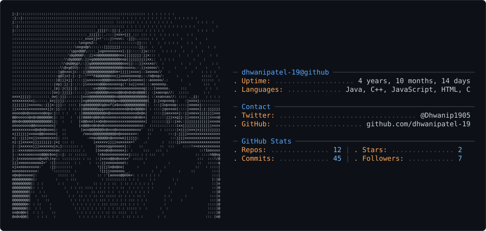

- 👋 Hi, I’m @Dhwani Patel...
- 💻 Member of Google Developers Group (GDG) Ahmedabad...
- 🖥️ Member of Women Techmakers Ahmedabad... 
- 👀 Master in C, C++, Python, Java, Flutter development ... 
- 🌱 Currently learning Artificial Intelligence and Machine Learning...
- 💞️ I’m looking to collaborate on Flutter projects...
- 📫 info.dhwanipatel19@gmail.com
- 📫 https://www.linkedin.com/in/dhwani-patel-05756a223

<!---
Anonymous-d19/Anonymous-d19 is a ✨ special ✨ repository because its `README.md` (this file) appears on your GitHub profile.
You can click the Preview link to take a look at your changes.
--->
